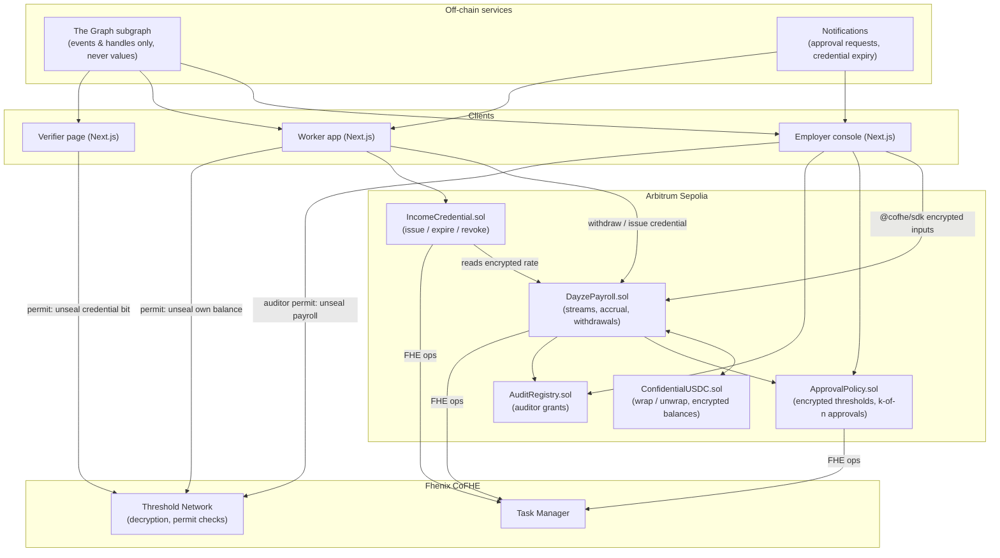

# Dayze — Architecture Document

**Private payroll streams, with income you can prove but never reveal**
Colosseum Hackathon (EVM / Arbitrum track — Consumer Products and Payments)
Version 0.1 (hackathon scope)

---

## 1. Executive Summary

Dayze lets an employer ("Payer") stream salaries to workers ("Payees") **second by second** on Arbitrum, with every rate, balance and withdrawal stored as **FHE ciphertext** via Fhenix CoFHE. No one onchain, including other employees, competitors and block explorers, can see what anyone earns.

The employer keeps control in two ways. A designated **Audit Key** can decrypt payroll for accounting and compliance. **Encrypted approval rules** (for example, "any salary over $10k/month needs a second approver") are evaluated on ciphertext, so the policy is enforced without revealing the figure.

The worker gets something PayGate-style treasury tools never give them: an **Income Credential**. It is a verifiable "earns ≥ $X/month" answer that the worker issues to a specific landlord or lender, that expires on the worker's terms, and that reveals one bit — yes or no — instead of the salary.

---

## 2. Why This Is a Real Problem (and why existing tools don't solve it)

Onchain payroll keeps colliding with two problems:

1. **Stablecoin payroll publishes everyone's salary.** A USDC transfer is readable by anyone. Paying a team onchain tells every employee, competitor and stranger what each person earns, forever. That is unacceptable in any normal workplace, and it is why most companies keep payroll offchain.
2. **Crypto income is hard to prove without over-sharing.** To rent a flat or get a loan, a worker has to show payslips or bank statements, which disclose the exact salary and more. A wallet address makes this worse: sharing it exposes the worker's entire financial history.

| Problem                      | Dayze's answer                                                                      | Why it's the right tool                                                                                    |
| ---------------------------- | ----------------------------------------------------------------------------------- | ---------------------------------------------------------------------------------------------------------- |
| Public salaries              | Rates, balances and withdrawals are `euint64` ciphertext on CoFHE                   | FHE lets the contract compute accrual on encrypted values, so the salary never exists in plaintext onchain |
| Employer loses oversight     | Audit Key + encrypted approval policies                                             | Compliance and spend controls work _without_ making the data public                                        |
| Over-sharing to prove income | Income Credential that reveals a single bit, scoped to one verifier, with an expiry | The landlord learns "≥ $X: yes", not the salary, and only for as long as the worker allows                 |

**Existing tools and where Dayze differs:**

| Project                                    | What it does                            | Gap Dayze fills                                                       |
| ------------------------------------------ | --------------------------------------- | --------------------------------------------------------------------- |
| PayGate (ETHOnline 2026, Privy B2B winner) | Approval-gated stablecoin payouts       | Payouts are public transfers, and there is nothing for the worker     |
| CipherPay                                  | FHE payroll with a SalaryProof          | No per-second streaming, and its proof is a permanent onchain boolean |
| ShieldStream (Colosseum 2026, Solana)      | ZK-proven private streaming payroll     | No income credential for third parties, and it isn't on EVM           |
| Hinkal                                     | Private batch payouts with viewing keys | Batch payouts, not streams, and no income proof                       |

Dayze's position: the **stream is the income source the credential is built from**, and the credential expires.

---

## 3. Track Fit

### 3.1 Consumer Products and Payments

- Payroll is the canonical consumer payment, and Dayze makes it **private by default**. The privacy is part of the runtime, not a setting the worker has to turn on.
- The worker-facing product (a live private balance and a shareable income credential) is a consumer experience, not just employer back-office tooling.

### 3.2 Arbitrum

- CoFHE is live on **Arbitrum Sepolia**, and Fhenix has a strategic partnership with Offchain Labs. Dayze is built on the Arbitrum-native path for encrypted computation.
- Low L2 fees make frequent withdrawals and per-verifier credential issuance practical. On L1, each would be a meaningful cost.
- **Honest note:** CoFHE also runs on other EVM testnets, so Arbitrum is the best venue here rather than the only possible one. The pitch leans on the Fhenix × Arbitrum stack, not on claiming Dayze is impossible elsewhere.

---

## 4. Core Concepts & Terminology

| Term                  | Definition                                                                                                                                          |
| --------------------- | --------------------------------------------------------------------------------------------------------------------------------------------------- |
| **Payer**             | The employer organisation. Funds a payroll vault and creates streams.                                                                               |
| **Payee**             | A worker receiving a stream. Can see their own rate and balance via a CoFHE permit.                                                                 |
| **Stream**            | A per-Payee record: encrypted `ratePerSecond`, `startTime`, `lastSettled`, encrypted `withdrawn`, and status.                                       |
| **cUSDC**             | Confidential wrapped USDC. USDC goes in, an encrypted balance comes out. Wrapping and unwrapping are the only points where amounts touch plaintext. |
| **Audit Key**         | An auditor address the Payer grants decrypt rights on payroll ciphertexts (via `FHE.allow`).                                                        |
| **Approval Policy**   | An encrypted threshold plus a required approver count. Streams above the threshold need k-of-n approver signatures before activating.               |
| **Income Credential** | A per-verifier, time-bounded record whose payload is an encrypted boolean `monthlyIncome ≥ threshold`, decryptable only by that verifier.           |
| **Verifier**          | A landlord or lender. Receives a credential link and sees ✅ / ❌ plus the credential's metadata.                                                   |
| **Permit**            | A CoFHE EIP-712 permit that proves identity to the Threshold Network so a user can unseal ciphertexts they're allowed to see.                       |

---

## 5. High-Level Architecture

**Why there's no backend holding secrets:** every sensitive value is a ciphertext handle whose access list is enforced onchain (`FHE.allow`) and by the Threshold Network at decrypt time. The frontend encrypts inputs in-browser with `@cofhe/sdk`. The subgraph indexes events that carry handles, never plaintext. A compromised Dayze server can't read salaries, because it never holds the keys.

**One correction worth recording: "zero-knowledge" describes a property here, not a SNARK.** The pitch says "ZK income proof". In this build, the mechanism is an **FHE comparison** (`FHE.gte(monthlyIncome, threshold)`) whose single-bit result is decryptable only by the verifier. The verifier learns nothing beyond yes/no, which is the zero-knowledge property the product promises.

A SNARK would add a consistency problem. To prove a statement about an FHE-encrypted rate, the worker would need a separate commitment to the rate, plus proof that it matches the ciphertext, which is hard to do. The FHE comparison is guaranteed consistent with the actual stream because it is computed _from the stream's own ciphertext_.

When presenting, say: **"zero-knowledge income check, enforced by FHE."** A portable SNARK credential that can be verified on other chains is on the roadmap (§10), not in the build.

---

## 6. Component Breakdown

### 6.1 Frontend

- **Next.js** app with three role views: Employer console, Worker app, Verifier page.
- `wagmi` / `viem` for wallet interactions. `@cofhe/sdk` (+ `@cofhe/react`) for in-browser encryption of inputs and permit-based unsealing.
- **Worker's live balance:** the app unseals `ratePerSecond` once via permit and then ticks the balance locally (`rate × elapsed − withdrawn`). The number moves every second on screen with zero transactions. Onchain state only changes on withdraw.
- **Verifier page:** opens from a credential link, reads the credential's plaintext metadata from the contract, and unseals the result bit with the verifier's permit.

### 6.2 Smart contracts (Arbitrum Sepolia)

| Contract               | Responsibility                                                                                                                                                                                                                                                                                                                                                                                                                              |
| ---------------------- | ------------------------------------------------------------------------------------------------------------------------------------------------------------------------------------------------------------------------------------------------------------------------------------------------------------------------------------------------------------------------------------------------------------------------------------------- |
| `DayzePayroll.sol`     | Payer vault (encrypted balance), stream creation and updates, lazy accrual, and withdrawals. Accrual is `FHE.mul(rate, FHE.asEuint64(elapsed))`, where elapsed time is plaintext and only the rate is encrypted. Withdrawals use `FHE.select(FHE.lte(req, available), req, 0)` so an over-withdrawal becomes a zero transfer instead of a revert that would leak information. The vault debit uses the same pattern to handle underfunding. |
| `ConfidentialUSDC.sol` | A minimal confidential wrapper. `wrap(amount)` takes USDC and credits an encrypted balance; `unwrap` uses the async decrypt flow to release USDC. If Fhenix's own confidential-token standard fits, use that instead of writing this.                                                                                                                                                                                                       |
| `ApprovalPolicy.sol`   | Stores an encrypted threshold and an approver set per Payer. On stream creation or raise, computes `needsApproval = FHE.gt(monthly, threshold)`, publishes that single bit via threshold decryption, and holds the stream `Pending` until k approvers sign.                                                                                                                                                                                 |
| `AuditRegistry.sol`    | Payer designates auditor addresses. Every new or updated stream handle is `FHE.allow`-ed to current auditors.                                                                                                                                                                                                                                                                                                                               |
| `IncomeCredential.sol` | The worker calls `issue(verifier, threshold, expiresAt)`. The contract computes `ok = FHE.gte(rate × 30 days, threshold)` from the live stream, requires the stream to be `Active`, `FHE.allow(ok, verifier)`, and stores `{payee, payer, verifier, threshold, issuedAt, expiresAt, revoked, okHandle}`. `revoke(id)` is worker-only. `isValid(id)` checks expiry and revocation.                                                           |

### 6.3 Encryption & access layer (Fhenix CoFHE)

- Encrypted types: `euint64` for amounts (USDC's 6 decimals fit comfortably) and `ebool` for policy and credential results.
- FHE operations are **asynchronous**: the contract submits tasks to the CoFHE Task Manager, the coprocessor computes offchain, and results come back as handles. Anything needing plaintext (unwrap, the approval bit) goes through the threshold-decrypt flow: `allowPublic`, then `decryptForTx`, then `publishDecryptResult`. The UI must show "processing" states for these steps.
- Access is per-handle: `FHE.allowThis` lets the contract keep using a value, `FHE.allow(handle, addr)` grants decrypt rights to a specific address, and users unseal via EIP-712 permits.

### 6.4 Off-chain services

- **Indexer (The Graph):** stream lifecycle, withdrawal events, approvals, and credential issuance and revocation. Events carry ciphertext handles and plaintext metadata only, so the index is safe to make public.
- **Notifications:** approval requests to approvers, "credential expiring" reminders to workers. This is UX, not a security control; the contracts are the source of truth.

---

## 7. Key Flows

### 7.1 Employer setup

1. Payer connects a wallet and creates an organisation (name plus optional ENS name, which shows on credentials).
2. Payer sets the Approval Policy: encrypted threshold (e.g. $10k/month) and approvers (k-of-n).
3. Payer designates an Audit Key address.
4. Payer wraps USDC into cUSDC and funds the payroll vault.

### 7.2 Create a stream

1. Payer enters the Payee's address and monthly salary. The browser encrypts it with `@cofhe/sdk`.
2. `DayzePayroll` converts the monthly amount to an encrypted `ratePerSecond`, then asks `ApprovalPolicy` to evaluate `needsApproval`.
3. If the decrypted bit is `false`, the stream is `Active` immediately. If `true`, it stays `Pending` until k approvers sign, then activates.
4. Rate handles are allowed to the Payee (to view), the auditors, and the contract.

### 7.3 Accrual & withdrawal

1. Nothing happens onchain while time passes. The worker app shows the balance ticking locally from the unsealed rate.
2. Worker withdraws: an encrypted request becomes `select(req ≤ available, req, 0)`. The vault is debited and the worker's cUSDC credited, all on ciphertext.
3. Worker optionally unwraps cUSDC to USDC. This is the one moment an amount becomes public, and the UI warns about it.

### 7.4 Income credential

1. A landlord asks for proof of ≥ $3,000/month. The worker enters the landlord's address, the threshold, and an expiry (e.g. 7 days).
2. `IncomeCredential.issue()` computes `ok = FHE.gte(monthly, 3000)` from the _live_ stream and allows `ok` to the landlord only.
3. The worker sends the credential link. The landlord's Verifier page shows: ✅ / ❌, issuer organisation, stream active since, issued at, expires at.
4. After `expiresAt`, or after worker revocation, `isValid()` returns false and the page shows **Expired** or **Revoked**.

### 7.5 Audit

1. The auditor signs a permit and unseals the rates, withdrawals and vault balance they've been allowed.
2. They export a CSV locally in their browser. Plaintext never touches a Dayze server.

---

## 8. Security & Trust Considerations

| Risk                                                                 | Mitigation                                                                                                     | Residual risk                                                                                                                                         |
| -------------------------------------------------------------------- | -------------------------------------------------------------------------------------------------------------- | ----------------------------------------------------------------------------------------------------------------------------------------------------- |
| Amounts leak at the edges                                            | All accrual and transfers happen on ciphertext                                                                 | Wrap and unwrap reveal amounts, and funding the vault reveals the employer's _total_ payroll deposit, though not per-person salaries                  |
| Who gets paid is visible                                             | Amounts are hidden                                                                                             | Payee addresses and stream existence are public in v0.1. Hiding them with `eaddress` is roadmap                                                       |
| Approval rule leaks information                                      | Threshold is encrypted, so the policy value is private                                                         | Publishing `needsApproval` reveals one bit: this salary is above or below the (hidden) threshold                                                      |
| Fake employer (worker creates a stream to themselves to fake income) | Credential shows the issuing organisation, how long the stream has been active, and how many months are funded | Dayze proves _what a contract pays_, not _who the employer is_. Business verification is out of scope, and the verifier judges the issuer             |
| Expiry isn't "forgetting"                                            | After expiry, `isValid()` fails and the page shows Expired                                                     | A verifier who already decrypted the bit knows it. Expiry ends the credential's _validity_, it can't erase knowledge. This is true of any proof       |
| Audit access is sticky                                               | New handles are only allowed to current auditors                                                               | `FHE.allow` grants on existing handles can't be withdrawn, so a removed auditor keeps access to data they were already granted                        |
| Salary changes after issuance                                        | Credential stores `issuedAt` and is computed from the live rate at that moment                                 | A credential is "as of issuance". Short expiries keep it honest                                                                                       |
| Decrypt-flow freshness                                               | Replay protection on decrypt results used in state changes                                                     | The async decrypt pattern needs careful handling. It was flagged as an open gap in comparable FHE payroll projects, so it gets a dedicated test suite |

---

## 9. Hackathon Scope

**In scope (MVP demo path):**

- `DayzePayroll`, `ConfidentialUSDC`, `ApprovalPolicy`, `AuditRegistry` and `IncomeCredential` deployed on Arbitrum Sepolia against live CoFHE.
- One organisation, one approval policy, one auditor, two or three streams.
- The live ticking balance in the worker app. The explorer shows nothing readable.
- One income credential issued to a verifier address, shown valid, then shown **expiring live**.
- Short demo timers (minutes, not months) so accrual and expiry can be shown at the demo table.
- Foundry with `@cofhe/foundry-plugin`: a fast unit suite on CoFHE mocks (`CofheTest`) plus fork tests against the live Arbitrum Sepolia threshold network.

**Explicitly out of scope:**

- Hidden Payee addresses (`eaddress`).
- SNARK-based portable credentials verifiable on other chains.
- Business verification of employers.
- Offchain income sources (zkTLS from bank or payroll portals).
- Yield on idle balances, multi-token payroll, mainnet deployment.

---

## 10. Post-Hackathon Roadmap

1. **Hidden recipients:** encrypt Payee addresses with `eaddress` so that who gets paid is private too, not just how much.
2. **Portable credentials:** SNARK wrapper so a credential can be verified on other chains or offchain without a CoFHE permit.
3. **Employer verification:** attach verified organisation identity (ENS plus a business attestation) to credentials to close the fake-employer gap.
4. **Income from anywhere:** accept zkTLS attestations (bank or payroll portals) as additional credential sources, so workers paid partly offchain can still prove their total income.
5. **Richer policies:** multiple approval groups with separate thresholds and budgets (PayGate-style), all evaluated on ciphertext.
6. **Mainnet**, once CoFHE ships on Arbitrum One.

---

## 11. Tech Stack Summary

| Layer         | Choice                                                           | Why                                                                                         |
| ------------- | ---------------------------------------------------------------- | ------------------------------------------------------------------------------------------- |
| Frontend      | Next.js, wagmi/viem, `@cofhe/sdk`, `@cofhe/react`                | In-browser encryption and permit-based unsealing, with no plaintext on servers              |
| Encryption    | Fhenix CoFHE (`FHE.sol`, `euint64` / `ebool`, Threshold Network) | Computation on encrypted salaries with per-handle access control; live on Arbitrum Sepolia  |
| Contracts     | Solidity, Arbitrum Sepolia                                       | Fhenix × Arbitrum stack; cheap enough for per-verifier credentials and frequent withdrawals |
| Tooling       | Foundry + `@cofhe/foundry-plugin` (mocks and live fork tests)    | Fast local iteration on mocks, real threshold-network tests before the demo                 |
| Indexing      | The Graph                                                        | Stream and credential history for dashboards; indexes handles, never values                 |
| Notifications | Email / push                                                     | Approval requests and expiry reminders; not a security control                              |

---

## 12. Closing Note

Every non-trivial decision above traces back to two constraints: **a salary should never exist in plaintext onchain**, and **proving income should reveal one bit, to one person, for a limited time**.

FHE is the right tool for the first because the contract has to _compute_ on salaries (accrue, compare against policy, debit the vault), not just hide them. The same encrypted computation delivers the second: the income check is computed from the stream's own ciphertext, so the credential can't drift from what the worker is actually paid.
